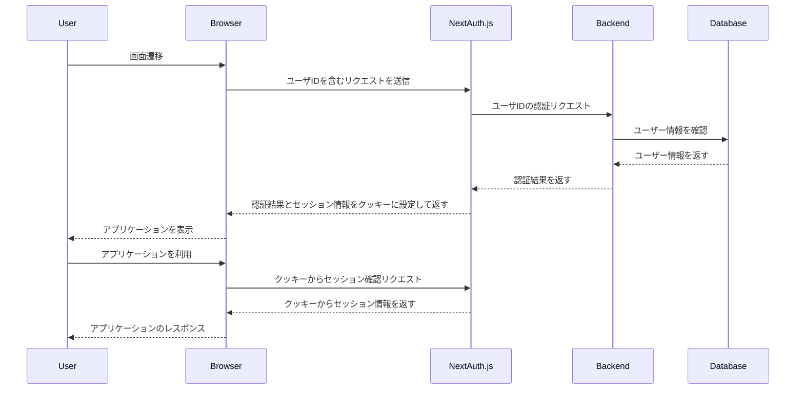

# 1. アプリ起動方法

## 1-1. ローカル起動
1. 任意のディレクトリに移動します：
    ```bash
    cd {任意のディレクトリ}
    ```
2. リポジトリをクローンします：
    ```bash
    git clone https://git-codecommit.ap-northeast-1.amazonaws.com/v1/repos/corp-automation-back
    ```
3. プロジェクトディレクトリに移動します：
    ```bash
    cd corp-automation-back
    ```
4. 依存関係をインストールします：
    ```bash
    npm install
    ```
5. 開発サーバーを起動します：
    ```bash
    npm run dev
    ```
6. URLを実行します：
- http://localhost:3000/corporateListing

## 1-2. デバッグ起動
VSCodeの「実行とデバッグ」から"Next.js: debug full stack"を選択して実行します。

## 1-3. ソース構成（Poc開発時点）
    (root)
     ├── Dockerfile                    # Dockerの設定ファイル
     ├── README.md                     # プロジェクトの説明文書
     ├── components.json               # コンポーネント設定ファイル
     ├── docker-compose.yml            # Docker Composeの設定ファイル
     ├── next-env.d.ts                 # Next.jsの環境設定ファイル
     ├── next.config.mjs               # Next.jsの設定ファイル
     ├── package-lock.json             # npmのロックファイル
     ├── package.json                  # プロジェクトの依存関係ファイル
     ├── postcss.config.mjs            # PostCSSの設定ファイル
     ├── public                        # 公開リソースディレクトリ
     │   └── images                    # 画像ファイル
     │       └── logo.png              # ロゴ画像
     ├── src                           # ソースコードディレクトリ
     │   ├── app                       # アプリケーションのルート
     │   │   ├── api                   # APIエンドポイント
     │   │   │   ├── auth              # 認証関連API
     │   │   │   │   ├── [...nextauth] # セッションAPI（NextAuth）
     │   │   │   │   │   ├── next-auth.d.ts
     │   │   │   │   │   ├── options.ts
     │   │   │   │   │   └── route.ts
     │   │   │   │   └── session      # セッション取得API
     │   │   │   │       ├── createToken
     │   │   │   │       │   └── route.ts
     │   │   │   │       └── getToken
     │   │   │   │   　      └── route.ts
     │   │   │   ├── corporateListing # 法人一覧API
     │   │   │   │   ├── delete       # 削除API
     │   │   │   │   │   └── route.ts
     │   │   │   │   ├── detail       # 詳細API
     │   │   │   │   │   └── route.ts
     │   │   │   │   └── listing      # 一覧API
     │   │   │   │       └── route.ts
     │   │   │   └── login             # ログインAPI
     │   │   │       └── route.ts
     │   │   ├── consts.ts             # 定数ファイル
     │   │   │   ├── apiUrls.ts        # APIエンドポイントURL
     │   │   │   ├── httpStatusCodes.ts # HTTPステータスコード
     │   │   │   └── pageTitleNames.ts # ページタイトル
     │   │   └── corporateListing      # 法人一覧
     │   │       ├── components        # コンポーネント
     │   │       │   ├── CorporateDetailModal.tsx
     │   │       │   └── CorporateListingTable.tsx
     │   │       ├── layout.tsx        # レイアウトファイル
     │   │       ├── page.tsx          # ページファイル
     │   │       ├── types.ts          # 型定義ファイル
     │   │       └── useCorporateListing.tsx # カスタムフック
     │   ├── components                # コンポーネント
     │   │   ├── button.tsx            # ボタン
     │   │   ├── errorBoundary.tsx     # エラーバウンダリー
     │   │   ├── header.tsx            # アプリケーションヘッダー
     │   │   ├── messageArea.tsx       # メッセージエリア
     │   │   ├── pagination.tsx        # ページネーション
     │   │   ├── table.tsx             # テーブル
     │   │   └── title.tsx             # タイトルエリア
     │   ├── lib                      # ライブラリファイル
     │   │   ├── logger.ts            # ログユーティリティ
     │   │   └── styleHelpers.ts      # CSSクラス名ユーティリティ
     │   ├── middleware.ts            # ミドルウェア
     │   ├── styles                   # スタイルシート
     │   │   └── globals.css          # グローバルスタイル
     │   └── utils                    # ユーティリティ関数
     │       └── ...
     ├── tailwind.config.ts           # Tailwind CSSの設定ファイル
     └── tsconfig.json                # TypeScriptの設定ファイル 
 
## 1-4. ダミー法人画面
ダミー法人画面リポジトリをクローンして起動します（詳細手順はREADMEを参照ください）：

```bash
git clone https://git-codecommit.region.amazonaws.com/v1/repos/test_django_mock_for_ph2
```
 

# 2. コーディング

## 2-1. 実装方法と進め方
- 機能開発において最低限必要なソース構成は下記のツリー図とする（例：法人一覧）

- フロントエンド、バックエンドともに法人一覧ディレクトリ（corporateListing）をコピーして新規機能を作成していく

- 基本的に機能開発者は閉じられた機能ディレクトリ内で開発を進める

- 共通化可能なコンポーネントやユーティリティが発見された場合は、本当に共通化が必要か？必要であればどの上位階層まで昇格するべきか？を周囲と協議の上で決定する

```
    ├── src
    │   ├── app
    │   │   ├── api
    │   │   │   └── corporateListing # 法人一覧API（バックエンド側）
    │   │   │       ├── delete        # 削除API
    │   │   │       │   └── route.ts
    │   │   │       ├── detail        # 詳細API
    │   │   │       │   └── route.ts
    │   │   │       └── listing       # 一覧API
    │   │   │           └── route.ts
    │   │   ├── corporateListing      # 法人一覧（フロントエンド側）
    │   │   │   ├── components        # コンポーネント
    │   │   │   │   ├── corporateDetailModal.tsx   # 詳細モーダル
    │   │   │   │   └── corporateListingTable.tsx  # 一覧テーブル
    │   │   │   ├── layout.tsx        # レイアウトファイル
    │   │   │   ├── page.tsx          # ページファイル
    │   │   │   ├── types.ts          # 型定義ファイル
    │   │   │   └── useCorporateListing.tsx # カスタムフック
```

## 2-2. 共通リポジトリの取り込み方法
<font color="Red">（Poc開発時点で共通リポジトリは未対応）</font>

### 2-2-1. リポジトリをクローンする

個別リポジトリをクローンします：

```bash
git clone https://git-codecommit.region.amazonaws.com/v1/repos/my-repo-a
cd my-repo-a
```

共通リポジトリをサブモジュールとして追加します：
```bash
git submodule add https://git-codecommit.region.amazonaws.com/v1/repos/shared-repo src/shared
git submodule update --init --recursive
```

既にリポジトリをクローンしている場合、サブモジュールを初期化および更新するには以下のコマンドを実行します：
```bash
git submodule update --init --recursive
```

### 2-2-2. 依存関係をインストールする
```bash
cd my-main-repo
npm install
```

### 2-2-3. サブモジュールの更新（オプション）
```bash
git submodule update --remote
```

### 2-2-4. アプリケーションを実行する
```bash
npm run dev
```
### 2-2-5. 追加情報
<font color="Red">わかり次第記載する</font>
#### サブモジュールの更新
```bash
```
#### サブモジュールの追加
```bash
```
#### サブモジュールの削除
```bash
```

## 3. UIコンポーネント
### 3-1. 配置場所
<table>
  <thead>
    <tr>
      <th>カテゴリ</th>
      <th>コンポーネント配置場所</th>
      <th>内容</th>
    </tr>
  </thead>
  <tbody>
    <tr>
      <td>共通</td>
      <td>src/components</td>
      <td>共通利用するコンポーネント（例：再利用可能なUIコンポーネント）</td>
    </tr>
    <tr>
      <td>機能個別</td>
      <td>src/app/{feature}/components</td>
      <td>該当機能内でのみ利用するコンポーネント（例：機能特化のコンポーネント）</td>
    </tr>
  </tbody>
</table>


### 3-2. 参考情報
#### 3-2-1. shadcn/uiついて

[shadcn/ui](https://github.com/shadcn/ui)という使い勝手の良いUIライブラリがありますのでご紹介しておきます。shadcn/uiは、Reactをベースにしたモダンで柔軟なUIコンポーネントライブラリです。以下は、shadcn/uiの特徴の一部です。

- **コンポーネントの豊富さ**: フォーム、モーダル、テーブルなど、多くの一般的なUIコンポーネントが提供されています。
- **カスタマイズ性**: テーマやスタイルのカスタマイズが容易で、プロジェクトのデザインに合わせた調整が可能です。
- **使いやすさ**: 直感的なAPI設計により、開発者が簡単に使用できるようになっています。

shadcn/uiの詳細な使用方法については、公式の[ドキュメント](https://ui.shadcn.com/docs)を参照してください。ちなみにshadcn/uiの利用についてはプロジェクトで強制するものではありません。

## 4. ロガー
### 4-1. Pinoについて

このプロジェクトでは、[Pino](https://github.com/pinojs/pino)を使用しています。Pinoは、高性能なNode.jsのログライブラリです。以下は、Pinoの特徴の一部です。

- **高速なログ処理**: Pinoは他の多くのログライブラリよりも高速で、パフォーマンスを重視した設計になっています。
- **軽量**: ログの出力が非常に軽量で、アプリケーションのパフォーマンスにほとんど影響を与えません。
- **シンプルなAPI**: 使いやすいAPIを提供し、素早く導入して利用開始することができます。

Pinoの詳細な使用方法については、公式の[ドキュメント](https://github.com/pinojs/pino)を参照してください。

### 4-2. 使用例
#### 4-2-1. 通常ログ
```javascript
const pino = require('pino');
const logger = pino();

// infoレベルのログ出力
logger.info('これは情報ログです');
logger.info({ key: 'value' }, 'これはオブジェクト付きの情報ログです');

// warnレベルのログ出力
logger.warn('これは警告ログです');
logger.warn({ key: 'value' }, 'これはオブジェクト付きの警告ログです');

// errorレベルのログ出力
logger.error('これはエラーログです');
logger.error({ key: 'value' }, 'これはオブジェクト付きのエラーログです');

// debugレベルのログ出力
logger.debug('これはデバッグログです');
logger.debug({ key: 'value' }, 'これはオブジェクト付きのデバッグログです');
```

#### 4-2-2. エラーログ
```javascript
const pino = require('pino');
const logger = pino();

try {
  throw new Error('エラーが発生しました');
} catch (err) {
  logger.error(err, 'これはスタックトレースを含むエラーログです');
}
```

### 4-3. ログレベル
<table>
  <thead>
    <tr>
      <th>ログレベル</th>
      <th>使用タイミング</th>
    </tr>
  </thead>
  <tbody>
    <tr>
      <td>INFO</td>
      <td>通常の動作や状態を記録するために使用します</td>
    </tr>
    <tr>
      <td>WARN</td>
      <td>想定外の動作や軽微な問題が発生したが、システムの動作には影響がない場合に使用します</td>
    </tr>
    <tr>
      <td>ERROR</td>
      <td>システムの動作に影響を与える重大な問題が発生した場合に使用します</td>
    </tr>
    <tr>
      <td>DEBUG</td>
      <td>開発中の詳細なデバッグ情報を記録するために使用します</td>
    </tr>
  </tbody>
</table>

### 4-4. ログメッセージのルール
#### 4-4-1. チェックポイントログ
処理のチェックポイントとしての役割を持たせるログメッセージに関しては、アプリ全体で統一感を持たせるため、メッセージを【XXX】で開始すること
```javascript
例）
【API START】帳票照会ダウンロードAPI
【LAMBDA START】帳票照会ダウンロードLambda
【LAMBDA END】帳票照会ダウンロードLambda
【API END】帳票照会ダウンロードAPI
```

#### 4-4-2. セキュリティルール
<font color="Red">セキュリティ観点でログ出力不可のデータはあるか？あるならば何か？明示したい</font>
```javascript
```

### 4-5. ログフォーマット
<font color="Red">Poc開発時点はデフォルトなのでカスタマイズ完了になり次第記載する</font>
```javascript
```


### 4-6. ログ出力に関する指針

#### 4-6-1. ログの重要性

プロジェクトの成功には、詳細で適切なログが欠かせません。ログはシステムの動作状況を把握し、問題の早期発見と迅速な解決に役立ちます。ログが不足すると、問題の根本原因を特定するのが難しくなり、結果としてシステム全体の信頼性が低下するリスクがあります。

#### 4-6-2. ログ出力に迷った場合の指針

ログが不足することのリスクは非常に大きいです。ログを出力することは、将来的なトラブルシューティングを容易にし、システムの健全性を維持するための重要なステップです。ログが多すぎると感じることがあっても、ログが無いことによるデメリットの方が遥かに大きいのです。

- **ログはシステムの命綱**：システムの状態を把握し、問題解決の手がかりとなる重要な情報源です。
- **迷ったらログを出力**：不足するよりは過剰である方が安全です。
- **後悔するのは、ログが無い時**：ログが無ければ、問題解決は困難を極めます。

ログ出力に迷うことがあれば、積極的にログを出力することを推奨します。ログが詳細であればあるほど、将来的なメンテナンスやトラブルシューティングにおいて大きな助けとなります。


## 5. セッション管理
### 5-1. NextAuth.jsについて

このプロジェクトでは、[NextAuth.js](https://next-auth.js.org/)を使用しています。NextAuth.jsは、Next.jsアプリケーションのための完全なオープンソース認証ソリューションです。以下は、NextAuth.jsの特徴の一部です。

- **簡単なセットアップ**: シンプルなAPIで迅速に設定可能。
- **柔軟な認証**: OAuth、メールリンク、認証情報など、複数の認証プロバイダーをサポート。また`credentials`プロバイダーを使用してカスタムの認証ロジックを実装可能。
- **セッション管理**: サーバーサイドおよびクライアントサイドでのセッション管理が可能。

NextAuth.jsの詳細な使用方法については、公式の[ドキュメント](https://next-auth.js.org/getting-started/introduction)を参照してください。


### 5-2. セッション管理のシーケンス図

以下は、Next.jsを使ったセッション管理のシーケンス図です。
[Mermaid Live Edit](https://mermaid.live/)などのMermaid形式が表示できる環境で確認してください



## 6. エラーハンドリング

### 6-1. 処理概要
<table>
  <thead>
    <tr>
      <th>アプリ</th>
      <th>区分</th>
      <th>内容</th>
    </tr>
  </thead>
  <tbody>
    <tr>
      <td rowspan="5"><strong>Next.js</strong></td>
      <td rowspan="2"><strong>フロントエンド</strong></td>
      <td>処理内でエラーを検知した場合は、メッセージ表示をするなど、各機能の仕様に則した処理を行う</td>
    </tr>
    <tr>
      <td>バックエンドからエラーステータスを受信した場合は、メッセージ表示をするなど、各機能の仕様に則した処理を行う</td>
    </tr>
    <tr>
      <td rowspan="3"><strong>バックエンド</strong></td>
      <td>処理内でエラーを検知した場合は、ステータスコードとエラーメッセージを返却する</td>
    </tr>
    <tr>
      <td>処理内で例外が発生した場合は、スタックトレースのログ出力を行う</td>
    </tr>
    <tr>
      <td>Lambdaからエラーステータスを受信した場合は、そのままフロントに返却するなど、各機能の仕様に則した処理を行う</td>
    </tr>
    <tr>
      <td rowspan="2"><strong>Lambda</strong></td>
      <td rowspan="2"><strong>バックエンド</strong></td>
      <td>処理内でエラーを検知した場合は、ステータスコードとエラーメッセージをNext.jsに返却する</td>
    </tr>
    <tr>
      <td>処理内で例外が発生した場合は、スタックトレースのログ出力を行う</td>
    </tr>
  </tbody>
</table>


### 6-2. ステータスコード
<table>
  <thead>
    <tr>
      <th>コード</th>
      <th>ステータス</th>
      <th>内容</th>
    </tr>
  </thead>
  <tbody>
    <tr>
      <td>200</td>
      <td>OK</td>
      <td>正常</td>
    </tr>
    <tr>
      <td>400</td>
      <td>BAD_REQUEST</td>
      <td>リクエストが不正</td>
    </tr>
    <tr>
      <td>401</td>
      <td>UNAUTHORIZED</td>
      <td>認証が必要なリソースに対して認証情報がない、または無効</td>
    </tr>
    <tr>
      <td>403</td>
      <td>FORBIDDEN</td>
      <td>リクエストされたリソースにアクセスする権限がない</td>
    </tr>
    <tr>
      <td>404</td>
      <td>NOT_FOUND</td>
      <td>リクエストされたリソースが存在しない</td>
    </tr>
    <tr>
      <td>500</td>
      <td>INTERNAL_SERVER_ERROR</td>
      <td>サーバー内部で予期しないエラーが発生</td>
    </tr>
    <tr>
      <td>503</td>
      <td>SERVICE_UNAVAILABLE</td>
      <td>サービスが一時的に利用できない</td>
    </tr>
    <tr>
  </tbody>
</table>

# 7. ソース管理

## 7-1. リポジトリ
<table>
  <thead>
    <tr>
      <th>カテゴリ</th>
      <th>リポジトリ</th>
    </tr>
  </thead>
  <tbody>
    <tr>
      <td>決済ポータル</td>
      <td>corp-automation-portal</td>
    </tr>
    <tr>
      <td>決済バック</td>
      <td>corp-automation-back</td>
    </tr>
    <tr>
      <td>共通リソース</td>
      <td>corp-automation-common</td>
    </tr>
    <tr>
      <td>バッチ</td>
      <td>aujb-corp-automation-batch</td>
    </tr>
    <tr>
      <td>インフラ</td>
      <td>aujb-corp-automation-infra</td>
    </tr>
    <tr>
  </tbody>
</table>

## 7-2. ブランチ運用
<font color="Red">住宅LSと同じ（URL）</font>


# 8. コードレビュー

## 8-1. コードレビューの考慮点

<table>
  <thead>
    <tr>
      <th>レベル</th>
      <th>カテゴリ</th>
      <th>内容</th>
      <th>UXに関わる</th>
    </tr>
  </thead>
  <tbody>
    <tr>
      <td rowspan="5"><strong>MUST（必須）</strong></td>
      <td rowspan="3"><strong>コードの健全性</strong></td>
      <td>エラーハンドリング</td>
      <td>はい</td>
    </tr>
    <tr>
      <td>バリデーション</td>
      <td>はい</td>
    </tr>
    <tr>
      <td>セキュリティ</td>
      <td>はい</td>
    </tr>
    <tr>
      <td rowspan="1"><strong>テスト</strong></td>
      <td>テストカバレッジ</td>
      <td>いいえ</td>
    </tr>
    <tr>
      <td rowspan="1"><strong>コーディング規約</strong></td>
      <td>言語特有のベストプラクティス</td>
      <td>いいえ</td>
    </tr>
    <tr>
      <td rowspan="6"><strong>NEED（重要）</strong></td>
      <td rowspan="2"><strong>コードの可読性</strong></td>
      <td>命名規則</td>
      <td>いいえ</td>
    </tr>
    <tr>
      <td>コメント</td>
      <td>いいえ</td>
    </tr>
    <tr>
      <td rowspan="2"><strong>コードの効率性</strong></td>
      <td>パフォーマンス</td>
      <td>はい</td>
    </tr>
    <tr>
      <td>リソース管理</td>
      <td>はい</td>
    </tr>
    <tr>
      <td rowspan="1"><strong>テストの質</strong></td>
      <td>実際のユースケースを反映したテスト</td>
      <td>はい</td>
    </tr>
    <tr>
      <td rowspan="1"><strong>ドキュメント</strong></td>
      <td>コードのドキュメント</td>
      <td>いいえ</td>
    </tr>
    <tr>
      <td rowspan="4"><strong>WANT（望ましい）</strong></td>
      <td rowspan="2"><strong>コードの保守性</strong></td>
      <td>モジュール性</td>
      <td>いいえ</td>
    </tr>
    <tr>
      <td>依存関係</td>
      <td>いいえ</td>
    </tr>
    <tr>
      <td rowspan="1"><strong>コードの整形</strong></td>
      <td>インデント、スペーシング</td>
      <td>いいえ</td>
    </tr>
    <tr>
      <td rowspan="1"><strong>チームのコーディングスタイル</strong></td>
      <td>チームで合意したコーディングスタイル</td>
      <td>いいえ</td>
    </tr>
  </tbody>
</table>

## 8-2. コードレビューの実践

1. **準備**
   - プルリクエスト（PR）を作成し、レビュアーをアサインする。
   - 必要なドキュメントやテスト結果を添付する。

2. **レビュー**
   - 各レベルの項目を順番にチェックする。
   - 必須項目（MUST）は必ず満たされているか確認する。
   - 重要項目（NEED）はできる限り対応する。
   - 望ましい項目（WANT）は余裕があれば対応する。

3. **フィードバック**
   - レビュアーは具体的なフィードバックを提供する。
   - レビューイはフィードバックを受けて修正を行う。

4. **マージ**
   - 全ての必須項目が満たされ、重要項目に可能な限り対応したら、コードをマージする。

# 9. AWS ECS デプロイ手順
DEV環境のECS（テスト用）に手動デプロイする手順を説明します。

## 9-1. 前提条件
* DockerおよびAWS CLIがCloud9環境にインストールされていること
* docker-composeがCloud9環境にインストールされていること
* docker-composeがインストールされていない場合は、下記コマンドを実施してインストールすること
```
sudo curl -L "https://github.com/docker/compose/releases/download/$(curl -s https://api.github.com/repos/docker/compose/releases/latest | grep -Po '"tag_name": "\K.*\d')/docker-compose-$(uname -s)-$(uname -m)" -o /usr/local/bin/docker-compose
sudo chmod +x /usr/local/bin/docker-compose
```

## 9-2. 手順
### 9-2-1. Cloud9
1. docker-compose.yml のイメージバージョンを確認する（イメージバージョンが0.0.3の手順）
```
image: 099676891200.dkr.ecr.ap-northeast-1.amazonaws.com/test-next-app-sample-repository:0.0.3
```
2. .env ファイルに .env.development の内容をコピーする（.env.developmentが存在しない場合は、.env ファイルに手動でテスト環境の設定を記載する）
```
cp .env.development .env
```
3. プロジェクトのルートディレクトリに移動してDockerイメージをビルド
```
cd <rootDir>
docker-compose up --build
```
4. Dockerイメージを確認
```
docker images
```
5. AWS ECRにログイン
```
aws ecr get-login-password --region ap-northeast-1 | docker login --username AWS --password-stdin 099676891200.dkr.ecr.ap-northeast-1.amazonaws.com
```
6. DockerイメージをECRにプッシュ
```
docker push 099676891200.dkr.ecr.ap-northeast-1.amazonaws.com/test-next-app-sample-repository:0.0.3
```

### 9-2-2. ECS
1. AWS管理コンソールで"Admin"にスイッチロールする

2. サービスに"Elastic Container Service"を選択する

3. クラスターに"TEST-next-app-sample"を選択する

4. サービスに”TEST-next-app-sample-ecs-private-service-new-alb-2”を選択する

5. 「サービスを更新」を押下する

6. 「必要なタスク」を "0" に変更して「更新」を押下する

7. タスクが終了することを確認する

8. 上記の 2 ～ 5 を実施の上、「必要なタスク」を "1" に変更して「更新」を押下する

9. タスクが起動することを確認する

10. サービスに"EC2"を選択する

11. "ターゲットグループ"を選択する

12. ターゲットグループに"TEST-next-app-sample-new-alb-tg"を選択する

13. ヘルスチェックが"Health"であることを確認する

### 9-2-3. 画面起動

1. サービスに"Elastic Container Service"を選択する

2. クラスターに"TEST-next-app-sample"を選択する

3. サービスに”TEST-next-app-sample-ecs-private-service-new-alb-2”を選択する

4. "設定とネットワークタブ"を選択する

5. "DNS 名"に表示されたオープンアドレスのリンクをクリックしてアプリケーション画面を開く

